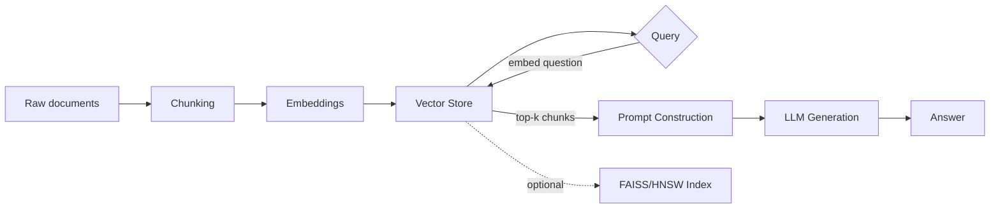

# RAG From Scratch

A Retrieval-Augmented Generation (RAG) system built stage-by-stage from
first principles — implementing chunking, vector search, and an ANN index
myself before reaching for production libraries, and backing it with a
real evaluation harness rather than eyeballing example outputs.


## Why this project

Most "RAG chatbot" tutorials glue together a framework and a vector DB in
an afternoon and can't explain a single design decision they made. This
project is built to survive that follow-up question:

- Chunking, cosine similarity search, and prompt construction are
  implemented from scratch before any library is used for the same job.
- A real evaluation harness measures **retrieval and generation
  separately** — because they fail independently (see results below).
- Runs entirely on free, open-source, local models — no API key required
  to reproduce any result in this README.

## Architecture



| Stage | File | What it does |
|---|---|---|
| 1. Chunking | `src/chunking.py` | Fixed-size, sentence-aware, and semantic chunking strategies, implemented from scratch |
| 2. Embeddings | `src/embeddings.py` | Wraps `sentence-transformers`; implements cosine similarity from scratch |
| 3. Vector Store | `src/vector_store.py` | Brute-force nearest-neighbor search, implemented from scratch as ground truth |
| 4. ANN Indexing | `src/faiss_store.py` | FAISS/HNSW index + benchmark script measuring speed vs. recall tradeoff against Stage 3 |
| 5. Retrieval + Generation | `src/generation.py`, `src/rag_pipeline.py` | Prompt construction and grounded answer generation |
| 6. Evaluation | `src/evaluation.py` | Separate retrieval hit-rate and generation keyword-overlap scoring |

## Results

Run against a 3-question test set (`src/evaluation.py`):

| Metric | Score |
|---|---|
| Retrieval hit rate | **100%** (3/3) |
| Generation avg. keyword score | **50%** |

**Key finding:** retrieval was perfect, but generation quality dropped
sharply on inference-heavy questions (e.g. "what problem does RAG
solve?" — requires connecting "reduces hallucination" to "the problem it
solves" rather than a literal text match). This isolates the
`flan-t5-small` generation model (a deliberately small, free, local
model) as the system's actual bottleneck — not retrieval, which a naive
end-to-end evaluation would have missed.

| Question | Retrieval | Generation score |
|---|---|---|
| What problem does RAG solve? | HIT | 0% |
| How does vector search find relevant documents? | HIT | 50% |
| What does the retriever do in a RAG system? | HIT | 100% |

## Setup

```bash
python -m venv venv
source venv/bin/activate  # or venv\Scripts\activate on Windows
pip install -r requirements.txt
```

## Usage

```bash
# Run each stage's standalone demo
python src/chunking.py
python src/embeddings.py
python src/vector_store.py
python src/faiss_store.py       # requires: pip install faiss-cpu
python src/rag_pipeline.py      # requires: pip install transformers torch

# Run the full evaluation report
python src/evaluation.py

# Run tests
python tests/test_chunking.py
```

## Tech stack

Python · sentence-transformers · FAISS (HNSW) · Hugging Face Transformers
(`flan-t5-small`) · NumPy

## Roadmap / possible extensions

- [ ] Hybrid search (dense + BM25 keyword fusion)
- [ ] Swap in a larger/hosted generation model and re-run evaluation
- [ ] Agentic multi-hop retrieval with query rewriting

## License

MIT
